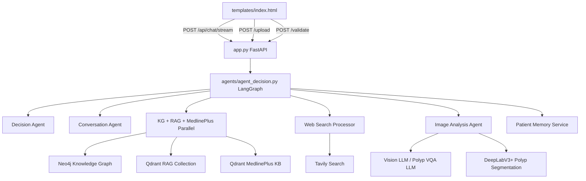
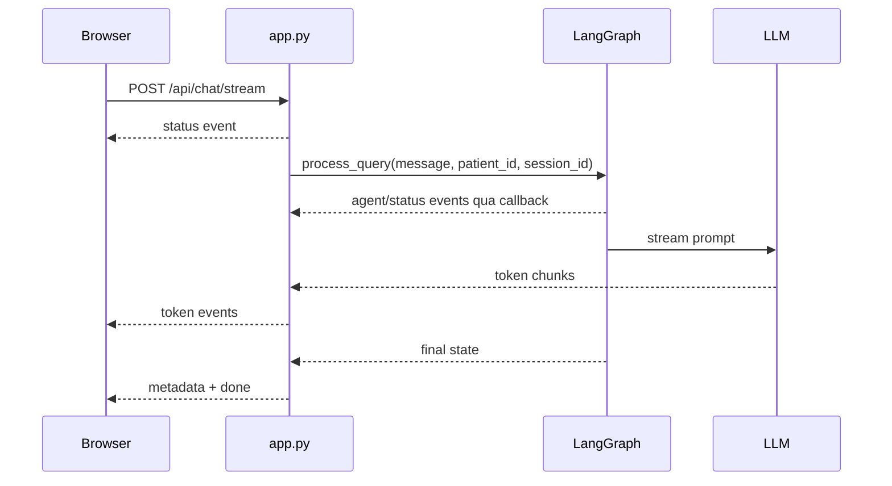
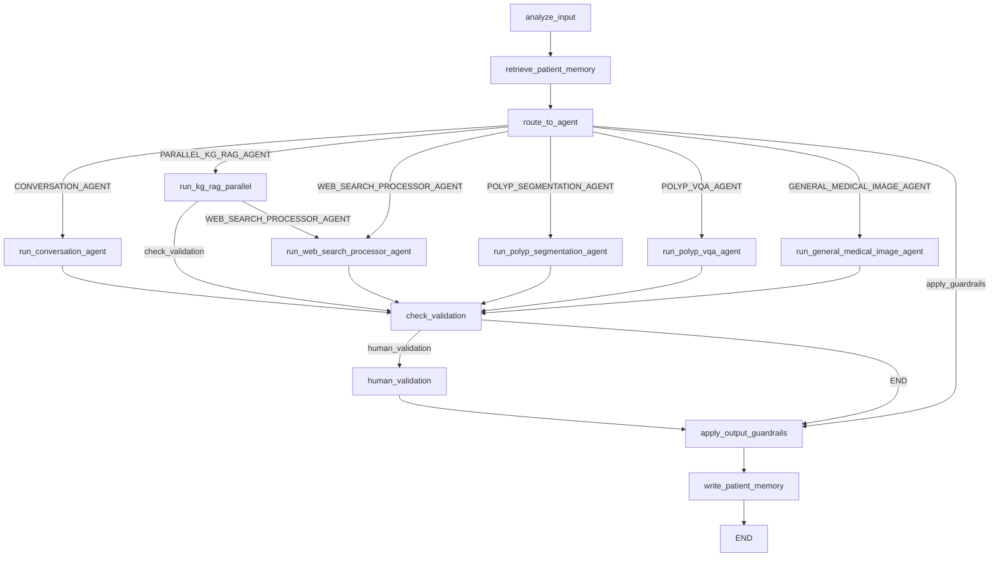
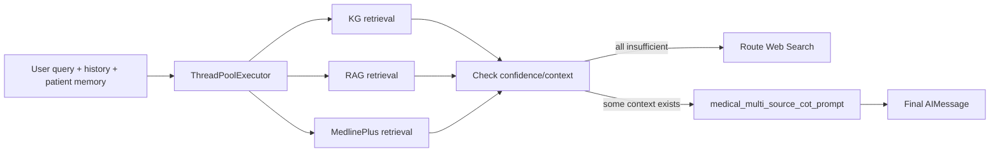

# Báo Cáo Kiến Trúc Và Workflow Codebase Medical Assistant

Tài liệu này mô tả chi tiết codebase `Medical_Assitant`, tập trung vào luồng chạy ứng dụng, nhiệm vụ của từng module, workflow của các case chính, và các lưu ý implementation/coding cho những hàm phức tạp. Phần `ingest_data/` không được phân tích theo yêu cầu.

## 1. Tổng Quan Hệ Thống

Project là một hệ thống trợ lý y tế đa tác nhân. Backend dùng FastAPI, orchestration dùng LangGraph, retrieval dùng Qdrant/Neo4j/Tavily/MedlinePlus KB, phần ảnh dùng vision LLM và mô hình segmentation DeepLabV3+, còn long-term memory dùng Mem0.

Các nhóm chức năng chính:

- Chat y tế thông thường.
- RAG từ vector database tiếng Việt.
- Knowledge Graph từ Neo4j.
- MedlinePlus KB bằng tiếng Anh, được query bằng câu hỏi đã dịch/tối ưu.
- Web search bằng Tavily khi KG/RAG/MedlinePlus không đủ thông tin hoặc router chọn web.
- Phân tích ảnh y tế tổng quát.
- Phân vùng polyp nội soi đại tràng.
- VQA trên ảnh polyp.
- Short-term memory qua LangGraph `MessagesState`.
- Long-term patient memory qua Mem0.
- Streaming token và event trạng thái về frontend bằng SSE.

Kiến trúc runtime ngắn gọn:



## 2. Entry Point Và API Backend

### `app.py`

Đây là entrypoint chính của backend. Khi file được import/chạy, nó:

- Khởi tạo `Config()`.
- Gọi `set_proxy()`.
- Tạo LangGraph một lần bằng `graph = create_agent_graph()`.
- Tạo FastAPI app.
- Include router patient memory tại `/api/patient-memory`.
- Tạo thư mục runtime:
  - `uploads/backend`
  - `uploads/polyp_seg_output`
  - `logs`
  - `logs/images`
  - `logs/reviews`
- Mount static `/uploads`.
- Render frontend từ `templates/index.html`.

Các thành phần quan trọng:

- `QueryRequest`: schema request chat. Có `message`, `image_data`, `conversation_history`, `patient_id`, `memory_enabled`.
- `extract_chat_response(response_data)`: lấy text cuối cùng từ LangGraph result. Ưu tiên `messages[-1].content`, fallback sang `output`.
- `sse_event(event, data)`: format event theo Server-Sent Events.
- `QueueStreamingCallback`: callback LangChain nhận token mới và agent/status event, đẩy vào `asyncio.Queue`.

Endpoints:

- `GET /`: redirect sang `/chat`.
- `GET /chat`: render giao diện chat.
- `POST /api/chat/stream`: nhận text chat, chạy `process_query()` trong thread nền, stream token/event về browser.
- `POST /upload`: nhận ảnh và text, lưu ảnh, gọi `process_query()` với input dạng `{"text": ..., "image": ...}`.
- `POST /validate`: nhận phản hồi human validation, log review nếu bị reject, rồi gọi lại `process_query()` với nội dung validation.
- `413 exception_handler`: trả JSON khi file quá lớn.

Luồng streaming `/api/chat/stream`:



Lưu ý implementation:

- `QueryRequest.conversation_history` hiện có trong schema nhưng route `/api/chat/stream` không truyền field này vào `process_query()`. Short-term memory ở web flow chủ yếu đến từ LangGraph checkpointer theo `session_id`.
- `/upload` và `/validate` đang hardcode `patient_id="PAT_001"`, trong khi `/api/chat/stream` dùng `request.patient_id`. Nếu cần multi-patient nhất quán, nên truyền patient id từ frontend cho upload/validate.
- `LargeRequestMiddleware` set private field `request._body_size_limit`; cần kiểm chứng với Starlette/FastAPI version hiện tại vì private attr có thể không có hiệu lực ổn định.

## 3. LangGraph Orchestration

### `agents/agent_decision.py`

Đây là file trung tâm điều phối agent. Nó định nghĩa state, router, workflow node, short-term memory, long-term memory retrieval/write, guardrails và output flow.

#### State

`AgentState` kế thừa `MessagesState`, vì vậy có field `messages` được LangGraph quản lý bằng reducer message. Các field chính:

- `messages`: lịch sử hội thoại ngắn hạn.
- `agent_name`: agent đang/đã xử lý.
- `current_input`: input hiện tại, có thể là string hoặc dict có ảnh.
- `has_image`, `image_type`, `eng_query`: thông tin sau bước phân loại ảnh.
- `output`: output cuối của agent trước khi append vào `messages`.
- `needs_human_validation`: ảnh y tế cần human validation.
- `retrieval_confidence`: confidence retrieval.
- `patient_id`, `session_id`: scope bệnh nhân và session.
- `patient_memory_context`: long-term memory từ Mem0.
- `memory_enabled`: bật/tắt long-term memory.
- `routing_agent`: agent được router chọn, dùng cho benchmark/evaluation.
- `polyp_segmentation_path`: đường dẫn ảnh segmentation output.

Short-term memory:

- `process_query()` set `state["messages"]` từ `conversation_history` nếu được truyền.
- Nếu không có `conversation_history`, nó tạo message hiện tại bằng `HumanMessage(content=query)`.
- Graph compile với `MemorySaver()`, và gọi bằng `thread_id = patient_id:session_id` nếu có session.
- Vì vậy, trong app web, cookie `session_id` giúp LangGraph giữ short-term history giữa các request.

Long-term memory:

- Node `retrieve_patient_memory` gọi `retrieve_patient_memory_for_query()`.
- Sau khi response xong, node `write_patient_memory` lưu memory nền bằng Mem0.
- Long-term memory được đưa vào decision input, query expansion và answer prompt như context hỗ trợ, không phải chẩn đoán xác nhận.

#### Helper Functions

- `get_agent_status_message(agent_name)`: map agent name sang status message để stream lên UI.
- `_input_to_text(current_input, include_image_hint=False)`: chuẩn hóa input dict/string thành text. Với ảnh có thể thêm hint upload image.
- `_shorten_text(text, max_chars=1200)`: truncate text khi lưu memory.
- `get_decision_chain()`: singleton chain gồm prompt phân loại agent, LLM và JSON parser.
- `retrieve_patient_memory_for_query(...)`: search Mem0 theo patient/query, trả context đã format.
- `_build_decision_input(...)`: tạo prompt input cho Decision Agent, gồm query, 6 message gần nhất, patient memory, image flags.
- `decide_agent_route(...)`: dùng cho benchmark/tooling để chạy router độc lập.
- `_format_patient_memory_context(...)`: format memory item thành bullet ngắn.
- `_memory_context_message(...)`: biến patient memory thành system message cho query expansion.

#### Workflow Nodes

Workflow được tạo trong `create_agent_graph()`:



#### `analyze_input(state)`

Nhiệm vụ:

- Nếu input là dict có `image`, gọi `image_analyzer.analyze_image()`.
- Set `has_image`, `image_type`, `eng_query`.
- Nếu không có ảnh, `eng_query` là text gốc.

Lưu ý:

- `image_type` được vision model trả về, kỳ vọng một trong:
  - `POLYP SEGMENTATION`
  - `GENERAL MEDICAL IMAGE`
  - `NON-MEDICAL`
- Nếu vision response không parse được JSON, classifier trả `unknown`.

#### `retrieve_patient_memory(state)`

Nhiệm vụ:

- Lấy `patient_id`, query text.
- Search Mem0 nếu `memory_enabled=True`.
- Nếu có memory context thì emit status event.
- Merge `patient_memory_context` vào state.

Lưu ý:

- Hàm được chạy trước router, nên memory có thể ảnh hưởng quyết định route.
- Nếu Mem0 lỗi, hệ thống skip memory và tiếp tục, không crash.

#### `route_to_agent(state)`

Nhiệm vụ:

- Nếu ảnh là `NON-MEDICAL`, trả output từ chối và route sang guardrails.
- Nếu ảnh là `POLYP SEGMENTATION`, dùng heuristic:
  - Không có text hoặc text yêu cầu segment/mask/overlay -> `POLYP_SEGMENTATION_AGENT`.
  - Có câu hỏi về ảnh -> `POLYP_VQA_AGENT`.
- Các case còn lại gọi Decision Agent LLM.

Decision Agent nhận:

- Query hiện tại.
- Recent conversation context.
- Long-term patient memory.
- Has image / image type.

Lưu ý:

- Decision output được parse JSON bằng `JsonOutputParser`.
- Nếu LLM trả JSON sai schema, node có thể lỗi. Đây là điểm nên harden bằng fallback parser/try-except nếu dùng production.

#### `run_conversation_agent(state)`

Nhiệm vụ:

- Trả lời các câu hỏi hội thoại/y tế thông thường.
- Dùng toàn bộ `state["messages"]` làm recent context.
- Nếu phát hiện follow-up về ảnh trước đó, tìm `image_id` trong metadata AIMessage và gọi summarizer follow-up.
- Ghép thêm long-term patient memory nếu có.

Lưu ý implementation:

- `follow_up_keywords` đang là list keyword tiếng Việt nhưng trong file có dấu hiệu mojibake ở nhiều chuỗi. Nếu source encoding không đúng, keyword matching tiếng Việt sẽ kém.
- Vòng build `recent_context` hiện dùng toàn bộ messages; comment nói limit từ config nhưng code chưa limit. Nếu conversation dài, prompt có thể phình token.

#### `run_kg_rag_parallel(state)`

Đây là node phức tạp nhất. Nó chạy song song 3 retrieval nhánh:

1. Knowledge Graph.
2. RAG vector DB tiếng Việt.
3. MedlinePlus KB.

Luồng bên trong:



KG branch:

- Dùng `rag_agent.query_expander.expand_query(..., mode="kg")`.
- Query expander trả JSON có:
  - `refined_question`
  - `patient_context`
- Gọi `kg_agent.response_generator.cypher_query_llm.retrieve_context_from_kg(refined_question)`.
- Lọc context bằng `ContextFilterEmbedding.filter_context(...)`.
- Cache KG candidates theo `patient_id:session_id`.
- Nếu KG hiện tại không có context, fallback sang cached KG candidates.

RAG branch:

- Dùng query expander mode `rag` để tạo Vietnamese retrieval query.
- Gọi `rag_agent.vector_store.retrieve_relevant_chunks(...)`.
- Tính confidence bằng max score của documents.

MedlinePlus branch:

- Dùng query expander mode `medlineplus` để dịch/tối ưu sang English query.
- Gọi `medlineplus_agent.retriever.retrieve(...)`.
- Ước lượng confidence bằng top score.
- Extract source list từ documents.

Sau retrieval:

- `has_kg_context`: chỉ cần có documents.
- `has_rag_context`: documents và confidence >= `config.rag.min_retrieval_confidence`.
- `has_medlineplus_context`: documents và confidence >= `config.medlineplus.min_retrieval_confidence`.
- Nếu cả 3 không đủ, route sang Web Search.
- Nếu có context, synthesize bằng `medical_multi_source_cot_prompt`.
- Cố parse JSON output để lấy `step3_action.content` và `follow_up_advice`.
- Append reference section từ RAG/MedlinePlus sources.

Lưu ý implementation quan trọng:

- Các worker đều nên luôn trả dict. File hiện đã có `normalize_retrieval_result()` để tránh lỗi `'NoneType' object has no attribute get'`.
- Khi thêm nhánh retrieval mới, cần trả format tối thiểu:
  - `agent_name`
  - `query`
  - `documents`
  - `confidence`
  - `sources`
- `ThreadPoolExecutor` gọi `.result()` tuần tự sau khi submit; tác vụ vẫn chạy song song vì submit trước rồi mới collect.
- KG cache đang nằm trong memory process của `KG ResponseGenerator`, không bền qua restart.
- Confidence threshold phụ thuộc semantics score của Qdrant/LangChain. Cần xác nhận score càng cao có thực sự tốt hơn với retrieval mode hiện tại.
- Parse JSON bằng regex/split markdown fence khá mong manh; production nên có parser tolerant hơn.

#### `run_web_search_processor_agent(state)`

Nhiệm vụ:

- Build recent context từ patient memory và `messages[-config.web_search.context_limit:]`.
- Tạo `WebSearchProcessorAgent`.
- Gọi Tavily search thông qua processor.
- Trả output AIMessage.

Lưu ý:

- `state["current_input"]` có thể là dict nếu từ upload, nhưng web processor signature nhận `query: str`. Nếu route web với dict input, nên chuẩn hóa bằng `_input_to_text()`.

#### `run_general_medical_image_agent(state)`

Nhiệm vụ:

- Lấy ảnh từ `current_input["image"]`.
- Gọi `image_analyzer.diagnose_general_medical_image()`.
- Nếu success, trả diagnosis.
- Set `needs_human_validation=True`.

Lưu ý:

- Output ảnh y tế luôn yêu cầu validation.
- Long-term patient memory được nối vào user query để vision model có thêm context, nhưng prompt cần nhắc rõ memory chỉ là hỗ trợ.

#### `run_polyp_segmentation_agent(state)`

Nhiệm vụ:

- Gọi `image_analyzer.segment_polyp()` để tạo overlay mask.
- Tạo diagnosis_result mô tả ý nghĩa vùng đỏ/xanh.
- Gọi `image_analyzer.summarize_diagnosis()` để sinh answer thân thiện.
- Set `polyp_segmentation_path`.
- Set `needs_human_validation=True`.

Lưu ý:

- `config.medical_cv.polyp_seg_output_path` là một path cố định. Nếu dùng path này cho nhiều request song song, có nguy cơ overwrite. `ImageAnalysisAgent.segment_polyp()` có logic tạo unique path khi `output_path=None`, nhưng node hiện truyền output path từ config.
- Text response có ký tự emoji/mojibake trong source. Nên chuẩn hóa UTF-8.

#### `run_polyp_vqa_agent(state)`

Nhiệm vụ:

- Dùng `state["eng_query"]` do image classifier tạo, vì polyp VQA model fine-tune có thể kỳ vọng English.
- Gọi `image_analyzer.answer_polyp_vqa()`.
- Đưa answer qua summarizer.
- Set `needs_human_validation=True`.

Lưu ý:

- Biến `segmentation_path` hiện luôn `None` vì segmentation call bị comment.
- Nếu muốn VQA dựa trên mask, cần gọi `answer_polyp_vqa_with_segmentation_mask()` hoặc sinh mask trước.

#### `handle_human_validation(state)` và `perform_human_validation(state)`

Nhiệm vụ:

- Nếu `needs_human_validation=True`, route sang `human_validation`.
- `perform_human_validation` hiện chỉ wrap lại output hiện có và append agent name `HUMAN_VALIDATION`.

Lưu ý:

- Nội dung "Human Validation Required" không được thêm rõ trong `perform_human_validation`; frontend hiện dựa vào agent name chứa `HUMAN_VALIDATION` để render validation UI.

#### `apply_output_guardrails(state)`

Nhiệm vụ:

- Kiểm tra output hợp lệ.
- Nếu output chứa `"Human Validation Required"` và input hiện tại là yes/no, trả thank-you message.
- Nếu không, tạo `sanitized_message` và update:
  - `messages`
  - `output`

Lưu ý:

- Vì `AgentState` kế thừa `MessagesState`, update `"messages": AIMessage(...)` sẽ được LangGraph reducer append vào history. Nếu đổi state base class, logic này sẽ cần chỉnh.
- Hiện chưa có guardrail thực sự như toxicity/PHI/safety classifier; tên hàm là placeholder cho output sanitization.

#### `write_patient_memory(state)`

Nhiệm vụ:

- Chạy sau guardrails.
- Nếu memory disabled hoặc non-medical filter thì skip.
- Tạo thread daemon `patient-memory-writer`.
- Nếu request là ảnh, lưu output như một `PatientConditionCreate` với source `ai_image_analysis`, `validated=False`.
- Nếu request text, lưu conversation qua `PatientConversationMemoryCreate`, `infer=True`.

Lưu ý:

- Write chạy background nên response không chờ Mem0. Tốt cho latency, nhưng lỗi chỉ log warning.
- Với ảnh, hệ thống lưu AI analysis chưa xác nhận; prompt retrieval cũng nhắc đây không phải chẩn đoán xác nhận.

#### `process_query(...)`

Đây là API nội bộ chính để app/benchmark gọi graph.

Các bước:

1. Tạo state mặc định bằng `init_agent_state()`.
2. Gán conversation history nếu có.
3. Set `current_input`, `patient_id`, `session_id`, `memory_enabled`.
4. Nếu input dict, convert text để tạo HumanMessage.
5. Nếu không có conversation_history, tạo `state["messages"] = [HumanMessage(content=query)]`.
6. Tạo `thread_id`.
7. Gọi `graph.invoke(state, dynamic_thread_config)`.
8. Cắt messages nếu dài hơn `config.max_conversation_history`.

Lưu ý:

- `session_id` rất quan trọng để short-term memory tách theo phiên.
- Nếu không truyền `session_id`, thread_id chỉ là `patient_id`, nghĩa là các conversation cùng patient có thể dùng chung checkpoint.

## 4. RAG Agent

### `agents/rag_agent/__init__.py`

Class `MedicalRAG` là facade cho RAG:

- Khởi tạo `VectorStoreCloud`, `Reranker`, `QueryExpander`, `ResponseGenerator`.
- Load Qdrant vectorstore theo collection config.
- `ingest_file(...)`: ingest document chunks vào vector store. Phần ingest không phân tích sâu theo yêu cầu.
- `evaluate_mcq(...)`: dùng cho benchmark MCQ, gồm expand query, similarity search, rerank, generate answer JSON.

### `agents/rag_agent/query_expander.py`

Class `QueryExpander` chuẩn hóa/mở rộng query theo mode:

- `mode="rag"`: tạo một query tiếng Việt tối ưu cho vector search.
- `mode="kg"`: tạo JSON gồm `refined_question` và `patient_context`.
- `mode="medlineplus"`: dịch/tối ưu query sang English cho MedlinePlus.

Hàm phức tạp:

- `_generate_expansions(...)`: prompt yêu cầu mở rộng query có kiểm soát, không bịa symptom.
- `_generate_kg_refine_query(...)`: prompt yêu cầu preserve negation, chuẩn hóa truy vấn KG và mô tả patient context. Parse JSON bằng regex.
- `_generate_medlineplus_query(...)`: prompt English, trả plain query text.

Lưu ý:

- Các prompt dài đang nằm inline trong code. Khi chỉnh prompt, cần test JSON parsing.
- `_generate_kg_refine_query()` dùng `re.search(r"\{[\s\S]*?\}", raw)` rồi `json.loads()`. Nếu model trả JSON nested hoặc text có `{}` ngoài ý muốn, parse có thể lỗi.

### `agents/rag_agent/vectorstore_qdrant_cloud.py`

Class `VectorStoreCloud` quản lý Qdrant vectorstore:

- `_clean_text(...)`: xóa control chars, normalize whitespace, chặn chuỗi quá dài.
- `_does_collection_exist(...)`: hỏi singleton `QdrantClientManager`.
- `_create_collection(...)`: tạo collection dense vector.
- `load_vectorstore(...)`: trả `QdrantVectorStore` LangChain.
- `create_vectorstore(...)` / `acreate_vectorstore(...)`: ingest chunks theo batch.
- `retrieve_relevant_chunks(...)`: similarity search và convert document thành dict.
- `retrieve_kg_docs_chunks(...)`: retrieval schema dành riêng cho KG docs.

Lưu ý:

- `create_collection()` trong `QdrantClientManager` xóa collection nếu đã tồn tại. Đây là hành vi nguy hiểm nếu gọi nhầm ở production.
- `retrieve_relevant_chunks()` trả `score` trực tiếp từ LangChain/Qdrant; downstream đang coi score cao là tốt.

### `agents/rag_agent/reranker.py`

Class `Reranker`:

- Load CrossEncoder từ `config.rag.reranker_model`.
- `rerank(query, documents)` tạo pairs `(query, doc["content"])`.
- Tính `rerank_score`, `combined_score`.
- Sort descending và cắt top_k.
- Nếu lỗi, fallback về ranking gốc.

Lưu ý:

- Reranker hiện dùng trong benchmark `evaluate_mcq`, không dùng trong `run_kg_rag_parallel()` production flow.

### `agents/rag_agent/response_generator.py`

Class `ResponseGenerator` cho RAG benchmark:

- `generate_response_benchmark(...)` format docs vào `rag_agent_mcq_evaluation_prompt`.
- Gọi LLM, parse JSON, trả `answer_index`, `not_enough_info`, `confidence`.

## 5. Knowledge Graph Agent

### `agents/kg_agent/__init__.py`

Class `KGQueryEngine` là facade cho KG:

- `cypher_service`: query Neo4j qua chain.
- `context_filter`: filter context theo embedding.
- `response_generator`: benchmark/generation helper.
- `retrieve_medical_context(question)`.
- `filter_context_for_patient(...)`.
- `evaluate_mcq(...)`.
- `get_disease_information(disease_name)`.
- `clear_caches()`.

### `agents/kg_agent/kg_manager.py`

Class singleton `KGManager`:

- Tạo Neo4j graph bằng `get_graph_db()`.
- Tạo LLM và embedding model.
- Setup `GraphCypherQAChain` với few-shot prompt từ `utils.prompt`.
- `allow_dangerous_requests=True`, `return_direct=True`.

Lưu ý:

- Vì `allow_dangerous_requests=True`, prompt Cypher cần kiểm soát chặt để tránh query không mong muốn.
- `reset_connections()` có bug tiềm ẩn: gọi `self.get_llm(...)` nhưng class không có method đó; nên gọi imported `get_llm`.

### `agents/kg_agent/cypher_query_llm.py`

Class `CypherQueryService`:

- `retrieve_context_from_kg(question)`: gọi `kg_manager.cypher_chain.invoke(question)` và trả `full_result["result"]`.
- `execute_cypher_query(query, params=None)`: chạy query trực tiếp.
- `get_disease_info(disease_name)`: dùng prompt/query `cypher_query`.

### `agents/kg_agent/context_filter.py`

Có hai filter:

- `ContextFilter`: dùng LLM để lọc context theo patient demographics. Hiện không dùng trong parallel flow.
- `ContextFilterEmbedding`: dùng embedding similarity giữa `patient_context` và embedding disease trong KG.

`ContextFilterEmbedding.filter_context(...)`:

1. Embed `patient_context`.
2. Duyệt KG context.
3. Lấy `disease.embedding`, `disease.name`, symptom stats.
4. Tính cosine similarity.
5. Lấy top 3.
6. Query chi tiết từng disease bằng Cypher.
7. Trả list object gồm `disease_info` và `detailed_data`.

Lưu ý:

- Nếu `patient_context` rỗng hoặc embedding lỗi trả `[]`, cosine với vector disease có thể lỗi shape. Nên harden bằng check vector length.
- Code kỳ vọng KG context item có field `d`; nếu query schema đổi, filter sẽ bỏ qua item.

### `agents/kg_agent/response_generator.py`

Class `ResponseGenerator`:

- Tạo `CypherQueryService`, `ContextFilterEmbedding`, LLM, `QueryExpander`.
- Quản lý KG cache:
  - `set_cached_kg_candidates(candidates, patient_id=None)`
  - `get_cached_kg_candidates(patient_id=None)`
- `evaluate_mcq(...)`: query KG, filter, format prompt MCQ, parse JSON.

Lưu ý:

- Cache lưu JSON string trong memory process. Có cache global `cached_kg_candidates` và cache keyed theo patient/session.
- Nếu deploy multi-worker, cache không chia sẻ giữa workers.

### `agents/kg_agent/embedding_service.py`

Helper:

- `embed_text(text)`: gọi embedding model từ singleton KG manager.
- `cosine_similarity(a, b)`.
- `find_similar_embeddings(...)`.

## 6. MedlinePlus Agent

### `agents/medlineplus_agent/__init__.py`

Class `MedlinePlusAgent`:

- Wrap `MedlinePlusRetriever`.
- `process_query(...)` và `aprocess_query(...)`.
- `_process_query_sync(...)`: retrieve docs, build prompt, gọi LLM, trả response/sources/confidence.
- `_build_prompt(...)`: format documents, linked entities, relations và chat history.
- `_extract_sources(...)`: dedupe sources.
- `_estimate_confidence(...)`: max document score clamp 0..1.

Trong `run_kg_rag_parallel()`, code hiện không gọi `process_query()` full response mà chỉ dùng retriever trực tiếp để lấy context rồi synthesize chung với KG/RAG.

### `agents/medlineplus_agent/retriever.py`

Class `MedlinePlusRetriever`:

- Kết nối Qdrant collection MedlinePlus.
- `_link_entities_from_json(query)`: link entity từ `health_topics.json`, `lab_tests.json`.
- `_infer_intent(query)`: detect `interpretation`, `lab_test_lookup`, hoặc `general`.
- `retrieve(query, top_k=None)`:
  - embed query
  - `client.query_points(...)`
  - rerank theo linked entity và intent
  - convert payload sang document
  - optionally expand relations từ `relations.json`
- `_to_document(...)`: normalize payload schema.

Lưu ý:

- Default `MEDLINEPLUS_DATA_DIR` đang là Linux path `/home/hung/...`; trên Windows cần set env trong `.env`.
- Retriever phụ thuộc payload schema: `payload.doc_id`, `payload.doc_type`, `payload.text`, `payload.metadata`.

## 7. Web Search Agent

### `agents/web_search_processor_agent/__init__.py`

Class `WebSearchProcessorAgent` chỉ là facade gọi `WebSearchProcessor.process_web_results()`.

### `agents/web_search_processor_agent/web_search_processor.py`

Class `WebSearchProcessor`:

- `_build_prompt_for_web_search(...)`: dùng chat history để rewrite câu hỏi thành query web đầy đủ.
- `process_web_results(...)`:
  - Gọi LLM tạo web search query.
  - Gọi `WebSearchAgent.search(...)`.
  - Gọi LLM tóm tắt kết quả search.
  - Thêm safety disclaimer.

Lưu ý:

- Search result là string plain text từ Tavily; không có structured citation renderer riêng.
- Nếu Tavily lỗi, lỗi được đưa vào prompt như text `"Error retrieving..."`.

### `agents/web_search_processor_agent/web_search_agent.py`

Class `WebSearchAgent`:

- Hiện chỉ dùng `TavilySearchAgent`.
- Có comment PubMed agent nhưng chưa implement.

### `agents/web_search_processor_agent/tavily_search.py`

Class `TavilySearchAgent`:

- Dùng `TavilySearchResults(max_results=5)`.
- Return string gồm title/url/content/score.
- Catch exception và return error string.

## 8. Image Analysis Agent

### `agents/image_analysis_agent/__init__.py`

Class `ImageAnalysisAgent` là facade:

- `ImageClassifier`.
- `GeneralMedicalDiagnosisAgent`.
- `PolypVQAAgent`.
- `MedicalImageSummarizer`.
- `PolypSegmentation`.

Public methods:

- `analyze_image(...)`.
- `segment_polyp(...)`.
- `answer_polyp_vqa(...)`.
- `answer_polyp_vqa_with_segmentation_mask(...)`.
- `answer_polyp_vqa_original_image_only(...)`.
- `diagnose_general_medical_image(...)`.
- `summarize_diagnosis(...)`.
- `generate_followup_response(...)`.

Lưu ý:

- Khi `segment_polyp(output_path=None)`, facade tạo unique output path. Nhưng LangGraph node hiện truyền path cố định từ config.

### `agents/image_analysis_agent/image_classifier.py`

Class `ImageClassifier`:

- Convert local image thành data URL base64.
- Prompt vision model trả JSON:
  - `image_type`
  - `eng_query`
  - `confidence`
- Parse bằng `JsonOutputParser`.

Lưu ý:

- Classifier quyết định route ảnh, nên prompt/schema rất quan trọng.
- Nếu parse lỗi, trả `image_type="unknown"`, có thể khiến router chuyển Decision Agent thay vì image agent mong muốn.

### `agents/image_analysis_agent/general_diagnosis_agent.py`

Class `GeneralMedicalDiagnosisAgent`:

- Convert ảnh sang data URL.
- Prompt vision model phân tích ảnh y tế tổng quát.
- Return dict `diagnosis`, `success`, `image_path`.

Lưu ý:

- Prompt có disclaimer nhưng output vẫn được LangGraph đánh dấu cần human validation.

### `agents/image_analysis_agent/polyp_vqa_agent.py`

Class `PolypVQAAgent`:

- Trả lời câu hỏi về ảnh nội soi/polyp.
- Hỗ trợ:
  - original image only
  - original image + segmentation mask
- `_normalize_question(...)` fallback default question.
- `_invoke_vision_model(...)` catch lỗi và trả dict standardized.

### `agents/image_analysis_agent/summarizer_agent.py`

Class `MedicalImageSummarizer`:

- Có memory nội bộ `self.memory` theo `image_id`.
- `summarize_diagnosis(...)`:
  - hash image path thành `image_id`
  - lưu diagnosis gốc
  - lấy 5 message gần nhất làm history context
  - chọn prompt polyp segmentation hoặc general diagnosis
  - gọi LLM summarizer
  - thêm safety disclaimer
- `generate_followup_response(...)`:
  - lấy diagnosis cũ theo `image_id`
  - prompt LLM trả lời follow-up
  - thêm disclaimer.

Lưu ý:

- `image_id = str(hash(image_path))`; Python hash có thể random seed theo process, không ổn định qua restart. Nếu cần bền, dùng hash ổn định như SHA256 path/content.
- Memory ảnh nằm trong process, không persist.

### `agents/image_analysis_agent/polyp_seg_tool/polyp_seg_inference.py`

Class `PolypSegmentation`:

- Load DeepLabV3Plus encoder resnet50, `classes=3`.
- Load checkpoint `checkpoint["model"]`, bỏ prefix `module.`.
- `transform_image(...)`: resize 512x512, normalize ImageNet.
- `predict(...)`:
  - chạy model inference
  - argmax mask, one-hot 3 class
  - save mask
  - post-process regions
  - overlay mask lên ảnh gốc
  - return output path
- `process_regions(...)`: dùng HSV để gom region đỏ/xanh và set màu dominant.
- `overlay_mask(...)`: blend non-background mask với ảnh gốc.

Lưu ý:

- Cần file model lớn `deeplabv3_resnet50.pth`.
- Output resize 512x512, không giữ kích thước gốc.
- Màu trong OpenCV/PIL cần cẩn thận BGR/RGB. Code hiện có cả `cv2` và `PIL/imageio`.

## 9. Patient Memory Service

### `agents/patient_memory_service/schemas.py`

Định nghĩa Pydantic models:

- `ConditionType`: symptom, diagnosis, allergy, medication, treatment_response, vital_sign, risk_flag, lifestyle, general.
- `MemoryMessage`: role/content/name.
- `PatientScopedModel`: validate `patient_id` không rỗng, không whitespace.
- `PatientConditionCreate`: lưu fact y tế cụ thể.
- `PatientConversationMemoryCreate`: lưu conversation turns để Mem0 infer.
- `PatientMemorySearchRequest`.
- `PatientMemoryListRequest`.
- Response models cho write/search/list/delete.

### `agents/patient_memory_service/config.py`

Đọc `.env` và tạo `PatientMemorySettings`:

- Collection name.
- SQLite history DB path.
- Local Qdrant path hoặc cloud Qdrant URL/API key.
- Embedding dims.
- Agent id.
- LLM temperature/max tokens.
- Custom instructions cho Mem0 extraction.

Lưu ý:

- Custom instructions là hàng rào quan trọng: chỉ lưu fact y tế bền, không lưu chat casual/secrets/speculative diagnosis.

### `agents/patient_memory_service/memory_service.py`

Class `PatientMemoryService` wrap Mem0:

- Lazy-build Mem0 instance.
- `_build_mem0_config()` dùng:
  - Qdrant vector store
  - LangChain LLM từ `get_llm()`
  - LangChain embedding từ `get_embedding()`
  - custom instructions
- `add_condition(...)`: lưu fact explicit, `infer=False`.
- `add_conversation(...)`: lưu messages, có thể `infer=True`.
- `search(...)`: semantic search memories.
- `list_conditions(...)`.
- `delete_memory(...)`.
- `delete_patient_memories(...)`.
- `health()`.
- `_normalize_results(...)`: chuẩn hóa response Mem0 thành `PatientMemoryItem`.
- `get_patient_memory_service()`: singleton.

Lưu ý:

- Nếu `mem0ai[nlp]` chưa install, service raise `PatientMemoryServiceError`.
- `search()` build filters theo `user_id=patient_id` và `agent_id`.
- Background writes trong `agent_decision.py` dùng singleton này.

### `agents/patient_memory_service/api.py`

FastAPI router:

- `GET /api/patient-memory/health`.
- `POST /api/patient-memory/conditions`.
- `POST /api/patient-memory/conversations`.
- `POST /api/patient-memory/search`.
- `GET /api/patient-memory/patients/{patient_id}/conditions`.
- `DELETE /api/patient-memory/memories/{memory_id}`.
- `DELETE /api/patient-memory/patients/{patient_id}/conditions?confirm=true`.

File cũng có app standalone nếu chạy riêng.

## 10. Utils Và Cấu Hình

### `utils/config.py`

Singleton `Config` gom cấu hình:

- `AgentDecisoinConfig`: LLM router temperature 0.
- `ConversationConfig`: LLM conversation temperature 0.7.
- `WebSearchConfig`: LLM web, context_limit 20.
- `RAGConfig`: Qdrant, embedding dim 768, collection, top_k, reranker, thresholds.
- `MedlinePlusConfig`: collection, data_dir, top_k, vector_name, thresholds.
- `MedicalCVConfig`: vision LLM, polyp VQA LLM, summarizer LLM, segmentation model/output paths.
- `ValidationConfig`: agent nào cần validation.
- `APIConfig`: host, port, max image size.
- `UIConfig`.

Lưu ý:

- Typo class name `AgentDecisoinConfig`.
- Nhiều config hardcode model/collection/path; nên đưa ra `.env` nếu cần deploy nhiều môi trường.

### `utils/llm_config.py`

Factory cho model và DB:

- `OpenAIEmbeddings`: custom LangChain Embeddings dùng OpenAI-compatible embedding endpoint.
- `get_gemini_llm*`: hiện alias sang `get_llm()`.
- `get_gemini_vision_llm(...)`: Gemini vision model.
- `get_polyp_vqa_llm(...)`: dùng OpenAI-compatible endpoint nếu set `POLYP_VQA_MODEL` và `POLYP_VQA_BASE_URL`, fallback Gemini vision.
- `get_qwen_extra_body(...)`: disable thinking và set max completion tokens.
- `get_graph_db()`: Neo4jGraph.
- `get_embedding()`: embedding model `google/embeddinggemma-300m`.
- `get_llm(...)`: ChatOpenAI tới OpenAI-compatible `LLM_BASE_URL`, model `Qwen/Qwen3.6-27B`.

Lưu ý:

- `get_gemini_llm` tên là Gemini nhưng thực tế trả Qwen-compatible `get_llm()`.
- `ChatOpenAI(openai_api_base=...)` phụ thuộc endpoint local/remote hỗ trợ OpenAI API.

### `utils/streaming.py`

Streaming support:

- `current_stream_callback`: ContextVar giữ callback hiện tại.
- `get_stream_config()`: trả config callbacks nếu có.
- `emit_stream_event(event, payload)`: emit agent/status event.
- `invoke_with_streaming(model, prompt, max_completion_token=1024)`:
  - Nếu không có callback: gọi `model.bind(...).invoke(prompt)`.
  - Nếu có callback: gọi `.stream(prompt)`, gom chunks và gọi `callback.on_llm_new_token(...)`.
  - Return `AIMessage`.

Lưu ý:

- Chỉ những nơi dùng `invoke_with_streaming()` mới stream token thủ công. Các chỗ gọi `.invoke()` trực tiếp sẽ không stream token.

### `utils/proxy_setting.py`

Hiện `set_proxy()` không set gì vì code proxy bị comment. `unset_proxy()` set proxy env thành empty string.

### `utils/prompt.py`

Chứa prompt trung tâm:

- `decision_agent_prompt`.
- `conversation_agent_prompt`.
- `cypher_query`.
- `cypher_chain_prompt`.
- `examples_cypher_query`.
- `medical_cot_prompt`.
- `medical_multi_source_cot_prompt`.
- `medical_mcq_evaluation_prompt`.
- `rag_agent_mcq_evaluation_prompt`.
- `llm_base_mcq_evaluation_prompt`.
- `medical_direct_kg_prompt`.
- `medical_direct_rag_prompt`.

Lưu ý:

- Đây là file cần đọc trước khi đổi behavior agent, vì nhiều node chỉ format prompt từ đây.
- Một số file khác có prompt inline, không gom hết về `utils/prompt.py`.

### `agents/qdrant_client_manager.py`

Singleton Qdrant client:

- Khởi tạo bằng `config.rag.url` và `config.rag.api_key`.
- `does_collection_exist(...)`.
- `create_collection(...)`.

Lưu ý:

- `create_collection()` xóa collection cũ trước khi tạo lại. Cần cực kỳ cẩn thận nếu gọi ở runtime production.

## 11. Frontend

### `templates/index.html`

Frontend là single-page chat UI:

- Render chat form.
- Upload image preview.
- Clear chat UI.
- Stream text chat bằng `fetch('/api/chat/stream')`.
- Parse SSE blocks thủ công từ response body reader.
- Render agent thinking/status.
- Với image upload, gọi `/upload` bằng `FormData`.
- Render markdown bằng `marked`.
- Nếu agent có `HUMAN_VALIDATION`, render validation UI.
- Gửi validation qua `/validate`.
- Hiển thị result image nếu backend trả `result_image`.

Các JS function đáng chú ý:

- `getAgentMessage(agentName)`.
- `updateThinkingIndicator(...)`.
- `getAgentDisplayName(...)`.
- `resetAgentTracking()`.
- `sendValidation(validation, comments)`.
- `streamTextChat(message, thinkingElement)`.
- `handleSseBlock(block)` trong streaming.

Lưu ý:

- UI giữ `displayMessages` để log validation, nhưng backend short-term memory không dựa vào biến này trong `/api/chat/stream`; backend dựa vào LangGraph checkpoint/cookie.
- Nếu cần truyền patient_id hoặc memory toggle đồng bộ cho upload/validate, cần mở rộng form/request.

## 12. Benchmark Và Evaluation

### `benchmark/test_rag.py`

Benchmark RAG MCQ:

- Tạo `MedicalRAG`.
- Load dataset `data/benchmark/symptom_to_disease_mcq_one_hop.json`.
- Xử lý batch song song.
- Gọi `rag.evaluate_mcq(question, choices)`.
- Tính accuracy và not_enough_info_rate.
- Ghi output `data/benchmark/rag_mcq_results_one_hop.json`.

### `benchmark/test_kg.py`

Benchmark KG MCQ:

- Tạo `KGQueryEngine`.
- Load dataset two-hop.
- Gọi `kg_agent.evaluate_mcq(...)`.
- Tính accuracy và not_enough_info.
- Ghi result JSON.

### `benchmark/test_llm_base.py`

Baseline LLM không retrieval:

- Dùng `llm_base_mcq_evaluation_prompt`.
- Xử lý batch bằng ThreadPoolExecutor.
- Parse JSON answer.
- Tính accuracy.

### `benchmark/generate_memory_eval_data.py`

Sinh dataset memory eval:

- Các helper `_memory`, `_eval_query`, `_case`, `_session`.
- `build_cases()` tạo nhiều scenario:
  - allergy/drug safety
  - ambiguous routing
  - medication adherence
  - và các nhóm khác trong phần sau file
- Output `data/benchmark/memory_eval_cases.json`.

### `benchmark/test_memory_layer.py`

Benchmark memory layer:

- Mode:
  - `M0`: không memory.
  - `M1`: seed expected memories.
  - `M2`: write conversation memories rồi test extraction/retrieval.
- Đo:
  - extraction precision/recall
  - retrieval recall@3/@5
  - routing accuracy
  - memory routing lift
  - repeated question avoidance
  - optional full-system answer quality bằng LLM judge
- Có thể gọi full LangGraph nếu dùng `--full-system`.

### `evaluation/*.json`

Chứa kết quả evaluation đã sinh sẵn cho nhiều model/setting:

- `eval_*.json`: config hoặc input eval.
- `judge_results_*_summary.json`: summary metric.
- `judge_results_*_detail.json`: chi tiết từng sample.

## 13. Các File Khác

### `README.md`

README ngắn giới thiệu project, feature và quick start. Báo cáo này bổ sung phần kiến trúc chi tiết.

### `requirements.txt` và `requirements_nlp.txt`

Danh sách dependency. Runtime chính cần FastAPI, LangChain, LangGraph, Qdrant, Neo4j, OpenAI-compatible clients, torch/vision/segmentation packages, Mem0, Tavily.

### `.vscode/settings.json`

Workspace VS Code settings. Hiện đã set Python interpreter:

```json
"python.defaultInterpreterPath": "C:\\Users\\Hung Zin\\anaconda3\\envs\\hunghq\\python.exe"
```

### `.env`

Chứa biến môi trường. Không nên commit secrets. Các biến quan trọng theo code:

- `LLM_BASE_URL`
- `GOOGLE_API_KEY`
- `QDRANT_URL`
- `QDRANT_API_KEY`
- `NEO4J_URI`
- `NEO4J_USER`
- `NEO4J_PASSWORD`
- `EMBEDDING_BASE_URL`
- `EMBEDDING_MODEL`
- `TAVILY_API_KEY`
- `POLYP_VQA_MODEL`
- `POLYP_VQA_BASE_URL`
- `POLYP_VQA_API_KEY`
- `MEDLINEPLUS_*`
- `PATIENT_MEMORY_*`

### `image.jpg`, `system.png`

Asset/test image hoặc hình minh họa. `system.png` có thể dùng trong tài liệu/README.

## 14. Workflow Theo Case

### Case A: Text Chat Thông Thường

Ví dụ: "Tôi nên ăn gì để ngủ tốt hơn?"

Luồng:

1. Frontend gọi `/api/chat/stream`.
2. `app.py` tạo streaming callback và gọi `process_query()`.
3. `process_query()` tạo state với `HumanMessage`.
4. `analyze_input`: không có ảnh.
5. `retrieve_patient_memory`: search Mem0 nếu bật.
6. `route_to_agent`: Decision Agent chọn `CONVERSATION_AGENT`.
7. `run_conversation_agent` tạo prompt từ query + history + memory.
8. LLM stream token.
9. `check_validation`: không cần validation.
10. `apply_output_guardrails`: append AIMessage vào `messages`.
11. `write_patient_memory`: background write conversation.
12. SSE trả done.

### Case B: Câu Hỏi Y Tế Cần Retrieval

Ví dụ: "Tôi bị đau bụng dưới bên phải và sốt, có thể là gì?"

Luồng:

1. Router chọn `PARALLEL_KG_RAG_AGENT`.
2. Node parallel chạy:
   - KG refine query + Neo4j + embedding filter.
   - RAG query expansion + Qdrant.
   - MedlinePlus English query + Qdrant MedlinePlus.
3. Nếu có context đủ:
   - Format KG/RAG/MED context.
   - Gọi `medical_multi_source_cot_prompt`.
   - Parse content/follow-up.
   - Thêm references.
4. Nếu không đủ:
   - Route sang `WEB_SEARCH_PROCESSOR_AGENT`.
5. Guardrails + memory write.

### Case C: KG/RAG/MedlinePlus Không Đủ, Fallback Web Search

Luồng:

1. Router hoặc parallel node chọn web.
2. `run_web_search_processor_agent` build recent context.
3. `WebSearchProcessor` rewrite query bằng LLM.
4. `TavilySearchAgent` lấy 5 kết quả.
5. LLM summarize web results.
6. Thêm disclaimer.
7. Guardrails + memory write.

### Case D: Upload Ảnh Không Phải Y Tế

Luồng:

1. Frontend gửi `/upload`.
2. Backend lưu file.
3. `analyze_input` gọi ImageClassifier.
4. Nếu `image_type="NON-MEDICAL"`:
   - `route_to_agent` tạo output từ chối.
   - `agent_name="NON_MEDICAL_FILTER"`.
   - Route thẳng `apply_guardrails`.
5. `write_patient_memory` skip vì non-medical.

### Case E: Upload Ảnh Y Tế Tổng Quát

Luồng:

1. ImageClassifier trả `GENERAL MEDICAL IMAGE`.
2. Router chọn `GENERAL_MEDICAL_IMAGE_AGENT`.
3. Agent gọi vision LLM phân tích ảnh.
4. Output set `needs_human_validation=True`.
5. `handle_human_validation` route sang `human_validation`.
6. Frontend thấy agent có `HUMAN_VALIDATION`, hiển thị validation UI.
7. `write_patient_memory` lưu AI image analysis là unvalidated memory.

### Case F: Upload Ảnh Nội Soi Polyp Và Yêu Cầu Phân Vùng

Luồng:

1. ImageClassifier trả `POLYP SEGMENTATION`.
2. Nếu text rỗng hoặc có keyword segment/mask/overlay, router chọn `POLYP_SEGMENTATION_AGENT`.
3. Agent chạy DeepLabV3+ segmentation.
4. Save overlay mask.
5. Summarizer tạo giải thích tiếng Việt.
6. Backend `/upload` trả thêm `result_image`.
7. Frontend render ảnh output.
8. Human validation flow.

### Case G: Upload Ảnh Polyp Và Hỏi Câu Hỏi VQA

Ví dụ: "Polyp này có đặc điểm gì đáng chú ý?"

Luồng:

1. ImageClassifier trả `POLYP SEGMENTATION` và `eng_query`.
2. Vì text không phải request segmentation trực tiếp, router chọn `POLYP_VQA_AGENT`.
3. Agent dùng `eng_query` gọi Polyp VQA model.
4. Summarizer tạo response cuối.
5. Human validation flow.

### Case H: Human Validation

Luồng reject/confirm:

1. Frontend gửi `/validate` với `validation_result`, comments và log context.
2. Nếu reject, backend ghi JSON review vào `logs/reviews`.
3. Backend gọi `process_query()` với query dạng `"Validation result: ... Comments: ..."` để hệ thống phản hồi.
4. Trả response validated/rejected cho frontend.

## 15. Lưu Ý Implementation/Coding Quan Trọng

### 15.1 Encoding Tiếng Việt

Nhiều file Python đang hiển thị chuỗi tiếng Việt bị mojibake như `Tôi`, `không`, `bệnh`. Điều này không chỉ xấu về hiển thị mà còn ảnh hưởng logic keyword matching.

Nên làm:

- Đảm bảo file lưu UTF-8.
- Nếu text đã bị mojibake trong source, cần khôi phục từ bản đúng hoặc decode lại cẩn thận.
- Test các keyword routing tiếng Việt sau khi sửa.

### 15.2 JSON Output Từ LLM

Nhiều nơi parse JSON từ LLM:

- Decision Agent.
- ImageClassifier.
- KG query expander.
- MCQ benchmark.
- Multi-source synthesis.

Nên làm:

- Bọc try-except quanh LLM JSON parse ở các node runtime quan trọng.
- Có fallback route an toàn.
- Log raw response khi parse lỗi.
- Dùng structured output nếu model/provider hỗ trợ.

### 15.3 State `messages` Của LangGraph

`AgentState` kế thừa `MessagesState`, nên update `"messages": AIMessage(...)` có ý nghĩa append message. Nếu đổi sang `TypedDict` thường, code sẽ hỏng logic history.

Khi thêm node mới:

- Luôn return `{"output": AIMessage(...), "agent_name": ...}`.
- Nếu muốn append vào chat history, để flow đi qua `apply_output_guardrails`.
- Không tự set `messages` thành list rỗng trừ khi muốn reset history.

### 15.4 Threading Và Background Jobs

Các điểm dùng thread:

- `/api/chat/stream`: chạy `process_query()` trong thread qua `asyncio.to_thread`.
- `run_kg_rag_parallel`: `ThreadPoolExecutor(max_workers=3)`.
- `write_patient_memory`: daemon thread.

Nên chú ý:

- Các singleton/model clients cần thread-safe ở mức provider.
- Background memory write có thể chưa xong khi request tiếp theo tới ngay.
- Nếu cần consistency mạnh, chuyển memory write sang queue/job có await hoặc status.

### 15.5 Cache KG

KG cache giúp fallback khi query hiện tại không lấy được context mới. Nhưng:

- Cache nằm trong process memory.
- Có key patient/session nhưng vẫn có global fallback.
- Không có TTL.

Nên cân nhắc:

- TTL cache.
- Clear cache khi session kết thúc.
- Không dùng global fallback nếu cần tách patient chặt.

### 15.6 Đường Dẫn Và Multi-Platform

Một số path hardcode:

- MedlinePlus default data_dir là Linux path.
- Polyp model path relative.
- Upload/log paths relative.

Nên:

- Đưa path sang `.env`.
- Dùng `Path` thay vì string concat.
- Kiểm tra Windows/Linux separator.

### 15.7 Safety Và Medical Validation

Hiện các image agent set `needs_human_validation=True`. Text/RAG/Web không yêu cầu validation. Tuy nhiên medical safety vẫn cần:

- Không chẩn đoán chắc chắn.
- Khuyến nghị khám bác sĩ khi có red flags.
- Trích nguồn rõ khi dùng retrieval.
- Không lưu speculative diagnosis vào long-term memory.

### 15.8 Web Search Citation

Web search hiện tóm tắt text kết quả Tavily, nhưng không format source links riêng như RAG/MedlinePlus. Nếu cần citation đáng tin hơn:

- Giữ structured results.
- Dedupe URL.
- Append reference section.
- Filter domain y tế đáng tin.

### 15.9 Qdrant Collection Creation

`QdrantClientManager.create_collection()` xóa collection nếu tồn tại. Không nên gọi tùy tiện trong runtime. Với production:

- Tách migration/admin script khỏi runtime.
- Thêm confirmation flag.
- Không delete collection trong helper generic.

### 15.10 Model Initialization Cost

`create_agent_graph()` khởi tạo nhiều model/clients:

- KGQueryEngine -> Neo4j/LLM/embedding.
- MedicalRAG -> Qdrant + reranker.
- MedlinePlusAgent -> Qdrant.
- ImageAnalysisAgent global -> segmentation model torch.

Startup có thể nặng. Nếu cần giảm thời gian boot:

- Lazy-load segmentation model khi ảnh polyp request đầu tiên.
- Lazy-load reranker nếu chỉ dùng benchmark.
- Health check tách shallow/deep.

## 16. Gợi Ý Khi Thêm Agent Mới

Checklist:

1. Thêm tên agent vào `get_agent_status_message()`.
2. Cập nhật `decision_agent_prompt` để router biết agent mới.
3. Thêm field state nếu cần.
4. Implement node function trong `create_agent_graph()`.
5. `workflow.add_node(...)`.
6. Thêm mapping trong `workflow.add_conditional_edges("route_to_agent", ...)`.
7. Đảm bảo node return:
   - `output`
   - `agent_name`
   - `needs_human_validation` nếu cần
   - `next` nếu node có conditional edge
8. Kiểm tra flow qua `check_validation`, `apply_guardrails`, `write_patient_memory`.
9. Thêm benchmark/test route nếu agent ảnh hưởng routing.

## 17. Gợi Ý Kiểm Thử Nhanh

Các lệnh kiểm tra cơ bản:

```powershell
python -m compileall app.py agents utils benchmark
```

Chạy app:

```powershell
python app.py
```

Benchmark RAG:

```powershell
python benchmark/test_rag.py
```

Benchmark KG:

```powershell
python benchmark/test_kg.py
```

Benchmark memory layer:

```powershell
python benchmark/test_memory_layer.py --modes M0 M1 M2
```

Full-system memory benchmark:

```powershell
python benchmark/test_memory_layer.py --full-system
```

Lưu ý trước khi chạy:

- Cần `.env` có endpoint LLM, embedding, Qdrant, Neo4j, Tavily.
- Cần model polyp segmentation tồn tại nếu test ảnh polyp.
- Cần MedlinePlus data_dir đúng nếu test MedlinePlus.

## 18. Kết Luận

Codebase được tổ chức quanh `agents/agent_decision.py` như một LangGraph orchestration layer. `app.py` chỉ nhận request, stream response và quản lý upload/validation. Các agent con có vai trò khá rõ: RAG cho tài liệu tiếng Việt, KG cho tri thức bệnh và symptom, MedlinePlus cho nguồn patient education tiếng Anh, Tavily cho fallback web, image agents cho phân loại/chẩn đoán/VQA/segmentation, và Mem0 cho long-term patient memory.

Các điểm cần ưu tiên nếu tiếp tục phát triển:

- Chuẩn hóa encoding tiếng Việt.
- Harden JSON parsing từ LLM.
- Chuẩn hóa patient_id cho upload/validate.
- Làm unique output path cho segmentation trong LangGraph node.
- Tách config hardcode sang `.env`.
- Bổ sung test route và test state history cho các workflow chính.
