# Flow của Multihop QA System - KG Agent và MedGemma Chain of Thought

## Tổng quan hệ thống (System Overview)

Hệ thống Multihop QA được thiết kế để xử lý các câu hỏi y tế phức tạp thông qua nhiều vòng tương tác với bệnh nhân, sử dụng Knowledge Graph Agent và MedGemma Chain of Thought để đưa ra chẩn đoán chính xác.

## Flow Diagram - Sơ đồ luồng xử lý

```mermaid
flowchart TD
    A[👤 Người dùng đặt câu hỏi y tế<br/>User Medical Query] --> B{🤖 Agent Decision<br/>Phân loại câu hỏi}
    
    B -->|Câu hỏi mơ hồ<br/>Vague Query| C[💬 CONVERSATION_AGENT<br/>Thu thập thông tin chi tiết]
    B -->|Câu hỏi cụ thể<br/>Specific Query| D[🔄 PARALLEL_KG_RAG_AGENT<br/>Xử lý song song KG + RAG]
    
    %% Conversation Agent Flow
    C --> C1[📝 Hỏi thông tin chi tiết:<br/>• Triệu chứng cụ thể<br/>• Thời gian xuất hiện<br/>• Mức độ nghiêm trọng<br/>• Vị trí<br/>• Yếu tố kích thích<br/>• Tiền sử bệnh]
    C1 --> C2[👤 Bệnh nhân cung cấp<br/>thông tin bổ sung]
    C2 --> B
    
    %% Parallel KG-RAG Agent Flow
    D --> E[🔍 Query Expansion<br/>Mở rộng truy vấn]
    E --> E1[📊 Patient Profile<br/>Lấy hồ sơ bệnh nhân]
    E --> E2[🧠 KG Agent Processing<br/>Xử lý Knowledge Graph]
    E --> E3[📚 RAG Agent Processing<br/>Xử lý RAG]
    
    %% KG Agent Detailed Flow
    E2 --> F[🔧 Cypher Query Generation<br/>Tạo truy vấn Cypher]
    F --> G[🕸️ Knowledge Graph<br/>Truy xuất từ KG]
    G --> H[🎯 Context Filtering<br/>Lọc ngữ cảnh theo bệnh nhân]
    H --> I[🏥 Disease Candidates<br/>Danh sách bệnh ứng viên]
    
    %% RAG Agent Flow  
    E3 --> J[🔍 Document Retrieval<br/>Truy xuất tài liệu y tế]
    J --> K[📄 Medical Documents<br/>Tài liệu chuyên khoa]
    
    %% Combine Results
    I --> L{⚖️ Information Assessment<br/>Đánh giá thông tin}
    K --> L
    E1 --> L
    
    L -->|Đủ thông tin<br/>Sufficient Info| M[🧠 MedGemma Chain of Thought<br/>Phân tích CoT]
    L -->|Thiếu thông tin<br/>Insufficient Info| N[🔍 WEB_SEARCH_AGENT<br/>Tìm kiếm web]
    
    %% MedGemma Chain of Thought Process
    M --> M1[📋 BƯỚC 1: Tổng hợp & Đối chiếu<br/>Synthesis & Cross-reference]
    M1 --> M1a[🔬 Phân tích từng bệnh ứng viên:<br/>• Tỷ lệ khớp triệu chứng M/T<br/>• Bằng chứng ủng hộ<br/>• Triệu chứng còn thiếu<br/>• Red flags<br/>• Clinical plausibility score]
    M1a --> M1b[⚖️ So sánh chéo các ứng viên:<br/>• Triệu chứng phân biệt<br/>• Ưu tiên loại trừ nguy hiểm]
    
    M1b --> M2[🎯 BƯỚC 2: Quyết định Y khoa<br/>Medical Decision]
    M2 --> M2a{🤔 Đánh giá thông tin}
    M2a -->|ENOUGH_INFO<br/>1 ứng viên nổi trội| M3a[✅ BƯỚC 3A: Chẩn đoán<br/>Diagnosis Action]
    M2a -->|NOT_ENOUGH_INFO<br/>Còn mơ hồ| M3b[❓ BƯỚC 3B: Hỏi thêm<br/>Follow-up Question]
    
    %% Final Actions
    M3a --> O[📋 Đưa ra chẩn đoán xác suất:<br/>• Giải thích y khoa<br/>• Tư vấn điều trị<br/>• Lời khuyên theo dõi<br/>• Cảnh báo an toàn]
    
    M3b --> P[❓ Đặt câu hỏi tiếp theo:<br/>• Triệu chứng quan trọng nhất<br/>• Ưu tiên red flags<br/>• Giải thích lý do cần hỏi]
    
    %% Web Search Flow
    N --> N1[🌐 Tìm kiếm thông tin y tế<br/>mới nhất trên web]
    N1 --> L
    
    %% Return to User
    O --> Q[👤 Trả lời cho người dùng<br/>Response to User]
    P --> R[👤 Hỏi thêm thông tin<br/>Ask for More Info]
    
    %% Multihop Continuation
    R --> R1[👤 Người dùng cung cấp<br/>thông tin bổ sung]
    R1 --> S[🔄 Cập nhật Chat History<br/>Update Conversation]
    S --> D
    
    %% Safety and Validation
    Q --> T[🛡️ Human Validation Check<br/>Kiểm tra xác thực]
    T --> U[⚠️ Apply Guardrails<br/>Áp dụng rào cản an toàn]
    U --> V[✨ Final Response<br/>Phản hồi cuối cùng]
    
    %% Styling
    classDef userNode fill:#e1f5fe,stroke:#01579b,stroke-width:2px
    classDef agentNode fill:#f3e5f5,stroke:#4a148c,stroke-width:2px  
    classDef processNode fill:#e8f5e8,stroke:#1b5e20,stroke-width:2px
    classDef decisionNode fill:#fff3e0,stroke:#e65100,stroke-width:2px
    classDef cognitiveNode fill:#fce4ec,stroke:#880e4f,stroke-width:3px
    classDef safetyNode fill:#ffebee,stroke:#c62828,stroke-width:2px
    
    class A,C2,R1,V userNode
    class C,D,N agentNode
    class E,E1,E2,E3,F,G,H,I,J,K,N1,S processNode
    class B,L,M2a,T decisionNode
    class M,M1,M1a,M1b,M2,M3a,M3b cognitiveNode
    class U safetyNode
```



## Chi tiết các thành phần chính

### 1. 🤖 Agent Decision System
- **Mục đích**: Phân loại câu hỏi và chọn agent phù hợp
- **Input**: Câu hỏi người dùng + lịch sử hội thoại
- **Logic**: 
  - Câu hỏi mơ hồ → CONVERSATION_AGENT
  - Câu hỏi cụ thể → PARALLEL_KG_RAG_AGENT
  - Hình ảnh y tế → Các agent chuyên biệt

### 2. 💬 Conversation Agent (Multihop Information Gathering)
- **Vai trò**: Thu thập thông tin chi tiết từ bệnh nhân
- **Chiến lược hỏi**:
  - Triệu chứng cụ thể
  - Thời gian xuất hiện
  - Mức độ nghiêm trọng (1-10)
  - Vị trí trên cơ thể
  - Yếu tố kích thích/làm giảm
  - Triệu chứng kèm theo
  - Tiền sử bệnh
  - Thuốc đang sử dụng

### 3. 🔄 Parallel KG-RAG Agent
- **Knowledge Graph Path**:
  - Query Expansion với patient profile
  - Cypher Query Generation
  - KG Retrieval
  - Context Filtering
  - Disease Candidates Generation

- **RAG Path**:
  - Query Expansion
  - Document Retrieval từ medical corpus
  - Reranking documents

### 4. 🧠 MedGemma Chain of Thought (Core CoT Process)

#### BƯỚC 1: Tổng hợp & Đối chiếu
```
1A) Phân tích từng bệnh ứng viên:
    - Tên bệnh
    - Tỷ lệ khớp triệu chứng: M/T
    - Danh sách matched_symptoms_list  
    - Bằng chứng ủng hộ từ detailed_data
    - Triệu chứng quan trọng còn thiếu
    - Red flags cần loại trừ
    - Clinical plausibility score (0.0-1.0)

1B) So sánh chéo các ứng viên:
    - Triệu chứng then chốt để phân biệt
    - Ưu tiên loại trừ bệnh nguy hiểm
```

#### BƯỚC 2: Quyết định Y khoa
```
- ENOUGH_INFO: 1 ứng viên nổi trội + đã loại trừ nguy hiểm
- NOT_ENOUGH_INFO: mơ hồ giữa ≥2 ứng viên hoặc còn red flags
```

#### BƯỚC 3: Hành động phù hợp
```
- ENOUGH_INFO → Chẩn đoán dựa trên xác suất
- NOT_ENOUGH_INFO → Hỏi triệu chứng quan trọng nhất
```

### 5. 🔄 Multihop Mechanism
1. **Vòng lặp thông tin**: Hệ thống liên tục hỏi thêm cho đến khi đủ thông tin
2. **Context preservation**: Lưu trữ lịch sử hội thoại và cập nhật ngữ cảnh
3. **Progressive refinement**: Mỗi vòng hỏi làm tinh chỉnh thêm chẩn đoán
4. **Safety-first approach**: Ưu tiên hỏi về red flags và triệu chứng nguy hiểm

### 6. 🛡️ Safety & Validation
- **Human Validation Check**: Kiểm tra các trường hợp cần xác nhận
- **Guardrails**: Áp dụng các rào cản an toàn
- **Disclaimer**: Luôn có cảnh báo về tính chất tham khảo

## Ví dụ Multihop QA Flow

### Kịch bản: Bệnh nhân với triệu chứng mơ hồ

```
👤 User: "Tôi cảm thấy không khỏe"

🤖 Agent Decision: CONVERSATION_AGENT (câu hỏi quá mơ hồ)

💬 Conversation Agent: "Bạn có thể mô tả chi tiết:
- Triệu chứng cụ thể nào?
- Từ khi nào?
- Mức độ 1-10?"

👤 User: "Tôi bị đau đầu và hơi sốt từ 2 ngày nay, mức độ khoảng 6/10"

🤖 Agent Decision: PARALLEL_KG_RAG_AGENT (đã có triệu chứng cụ thể)

🔄 Parallel Processing:
- KG Agent: Tìm các bệnh có triệu chứng đau đầu + sốt
- RAG Agent: Truy xuất tài liệu về đau đầu, sốt

🧠 MedGemma CoT:
BƯỚC 1: Phân tích ứng viên
- Cảm cúm: 8/12 triệu chứng khớp (đau đầu, sốt)
- Viêm xoang: 6/10 triệu chứng khớp  
- Viêm màng não: 4/8 triệu chứng khớp (RED FLAG!)

BƯỚC 2: NOT_ENOUGH_INFO (cần loại trừ viêm màng não)

BƯỚC 3: Follow-up question

❓ Response: "Để loại trừ các tình huống nghiêm trọng, bạn có bị:
- Cứng gáy?
- Buồn nôn/nôn?
- Sợ ánh sáng?
- Phát ban trên da?"

👤 User: "Không có triệu chứng nào trong số đó"

🔄 Tiếp tục xử lý...

🧠 MedGemma CoT:
BƯỚC 2: ENOUGH_INFO (đã loại trừ nguy hiểm)
BƯỚC 3: Diagnosis

✅ Final Response: "Dựa trên triệu chứng, khả năng cao bạn bị cảm cúm thông thường..."
```

## Đặc điểm nổi bật của hệ thống

1. **Intelligent Routing**: Tự động phân loại và chọn agent phù hợp
2. **Progressive Information Gathering**: Thu thập thông tin từng bước một cách thông minh
3. **Safety-First Approach**: Ưu tiên loại trừ các bệnh nguy hiểm trước
4. **Multi-source Knowledge**: Kết hợp KG và RAG để có thông tin toàn diện
5. **Chain of Thought Reasoning**: Suy luận y khoa có cấu trúc và minh bạch
6. **Context Awareness**: Nhớ và sử dụng lịch sử hội thoại hiệu quả
7. **Probabilistic Diagnosis**: Không khẳng định tuyệt đối, luôn đưa ra xác suất

Hệ thống này đảm bảo an toàn, chính xác và hiệu quả trong việc hỗ trợ chẩn đoán y tế thông qua multihop questioning.

